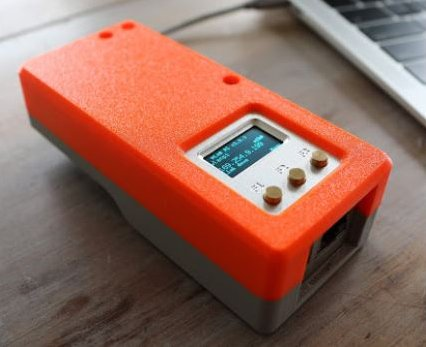

# Getting Started with the WLANPi

To get started with the WLANPi, you're going to need to get hold of some WLANPi hardware. The items you'll need are all relatively low cost and are relatively easy to get source. There are a few options availabe to get yourself a WLANPi:

- Attend a WLPC conference and attend one of the WLANPi deep dive sessions
- Buy a complete kit from the WLPC online store
- Source the individual items you'll need yourself from a number of sources.

Obviously, buying the kit from the [WLPC store][WLPC_Store] is a quick and easy option. You get the advantage of having all the components you need in one order, and the kit comes pre-assembled with a software image burned and ready to go. You also have a reputable, single source to contact if there are any issues with your purchase.

However, if you're a nuts & bolts type of person who like to roll up your sleeves and build stuff yourself, you can source the various component parts yourself and build from scratch. (This will likely take you quite a lot longer to do compared to buying the kit, but arguably may be more fun and slightly cheaper).

## Buying a Kit
If you'd like to buy a pre-built kit, check out our [suppliers page][Suppliers]. We'll keep this updated with kit buying options.

## Building Your Own Kit
Rolling your own WLANPi takes a little more effort than a pre-built kit, but with a little effort, you can source all of the parts and put one together.

Here is a list of the items you are going to need to source to build your own WLANPi:

- A NanoPi NEO2 from the [FriendlyArm company][Friendlyarm] (located in China): this is the WLANPi hardware platform itself
- A Comfast CF-912 USB wireless adapter: this is the currently recommended adapter to support he various wireless operations that the WLANPi supports
- An micro-SD to USB adapter module to allow images to be burned on to the WLANPi
- A USB to micro-USB cable to power and/or provide connectivity to the WLANPi (the flavour of USB cable will depend on your requirements)   
- Custom Handheld Case: Designed specifically for use with the WLAN Pi, houses the Wi-Fi adapter and USB-C cable, while still exposing the USB port and ethernet port on the bottom, while still allowing access to the MicroSD slot. Creation of Joel Crane [@Potato_Fi][Potato_Fi] 

More info: <http://www.potatofi.com/2019/10/the-wlan-pi-handheld-case.html>

[WLPC_2016]: https://www.wlanpros.com/resource/?wpv-category=2016-us-phoenix&wpv_aux_current_post_id=2623
[Getting_Started]: getting_started.md
[Suppliers]: suppliers.md
[Friendlyarm]: http://wiki.friendlyarm.com/wiki/index.php/NanoPi_NEO2
[WLPC_Store]: http://www.wlanpros.com/product-category/store/
[Potato_Fi]: https://twitter.com/Potato_Fi

