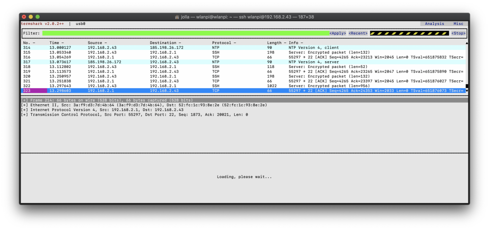

Title: Termshark
Authors: Nigel Bowden

# Termshark
<div style="float: center;">

</div>

Termshark is a terminal based UI that provides a Wireshark-type experience from the CLI. It provides many of the features of Wireshark, but delivered locally on the WLAN Pi via a text-based UI.

To get to know more about Termshark, visit the [official web site][termshark_web_site].

To try Termshark out on the WLAN Pi, SSH to your WLAN Pi (make sure your terminal emulation is setup to use ANSI mode and enable colours) and enter the following command:

```
 sudo termshark -i wlan0
```
(Note: make sure you have a WLAN adapter that supports monitor mode plugged in)

After a few seconds, you should see some activity on the UI and frames being decoded. To access the filter bar area, hit the '/' key and left/right arrows to make selections. To exit, hit the 'esc' key and use arrow keys to select 'Misc' and hit 'q' to quit.

You can find out more about using the application in the [official user guide][termshark_user_guide]

<!-- Link list -->
[termshark_web_site]: https://termshark.io/
[termshark_user_guide]: https://github.com/gcla/termshark/blob/master/docs/UserGuide.md

<small><br><i>Page last updated: {{ git_revision_date }} </i></small>