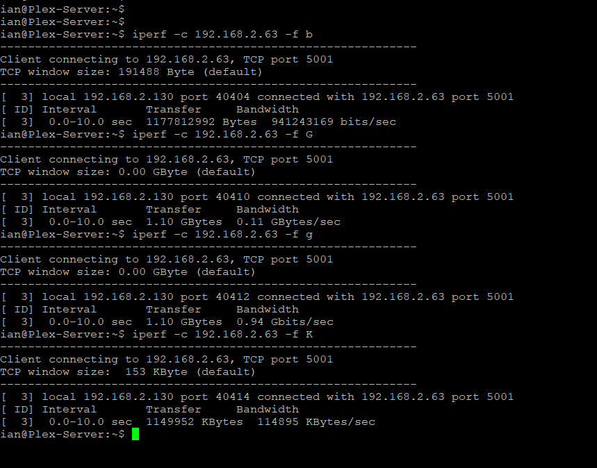
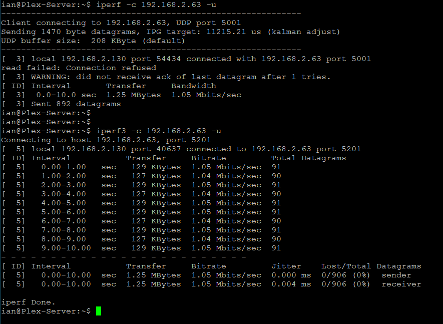

Title: iperf
Authors: Nigel Bowden

# iperf

iperf  is a tool for performing network throughput measurements.  It can test either TCP or UDP throughput.  To perform an iperf test the user must establish both a server (to discard traffic) and a client (to generate traffic).

The WLANpi has iperf2 and iperf3 servers running upon start-up, these servers are using the default options for each version. 

For reference iperf uses the following ports:
Iperf2 - 5001
Iperf3 - 5201

Iperf3 is a rewrite of iperf from scratch to create a smaller, simpler code base. Iperf3 is not backwards compatible with iperf2.


# Usage

To view all iperf options, take a look the manual pages for the software using the following CLI command in your SSH session (hit 'q' to quit the man pages) or use the -h or --help flag for listing of the commands:
man iperf / iperf3
iperf / iperf3 -h

# Examples

## Basic throughput test

```
iperf -c <serverIP> 
iperf3 -c <serverIP> 
```

<div style="float: center;">

</div>
 

## Displaying data formatted in different sizes. 

```
iperf/iperf3 -c serverIP  -f (b, B, k, K, m, M, g, G, t, T)
```

<div style="float: center;">

</div>

 
## iperf from server to client or bi-directional

```
iperf -c serverIP  -r -d
```
 
(iperf bi-directional.PNG)


iperf3 -c serverIP  -R or iperf3 -c serverIP  --bidir

<div style="float: center;">

</div>

## iperf using udp

```
iperf/iperf3 -c serverIP -u
```

<div style="float: center;">

</div>


# References

* [iperf home page][Home_Page]
* [iPerf2 vs iPerf3 | Panos Vouzis | WLPC Phoenix 2020][WLPC_Video]

<!-- Link list -->
[WLPC_Video]: https://youtu.be/nZOtocu12hw
[Home_Page]: https://iperf.fr/


