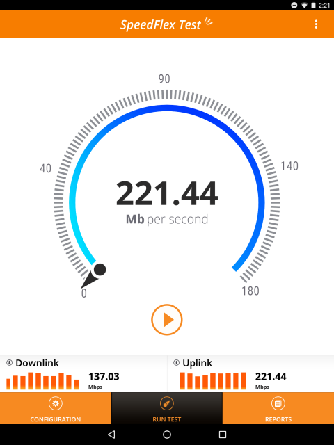

Title: Zap
Authors: Ian Stout

# Zap

Zap is a 3rd generation test tool developed by Ruckus to assist in wireless network test and characterization. In the common use case it works by sending bursts of 50 full-size UDP packets.  The packet loss and inter-arrival times are monitored and reported.  The primary results reported are number of packets lost, total packets received, and detailed throughput statistics.

The Zap server is run as a background process each time the WLAN Pi boots, so does not require any additional steps to activate. 

Performance tests are run by installing the [Speedflex][speedflex] app on a mobile device.

## Usage

The Ruckus Speedflex App is available for Android and iOS.

Just launch the app on your mobile device and set the IP address of your WLAN Pi as the "Destination Address" and any other changes under "Configuration". Finally, hit "Run Test". 

The app is now quite old, so not all settings may work on the latest versions. 

<!-- Link list -->
[speedflex]: https://www.commscope.com/resources/apps/ruckus-speedflex/

<small><i>(Contributed by Ian Stout)</i></small>

